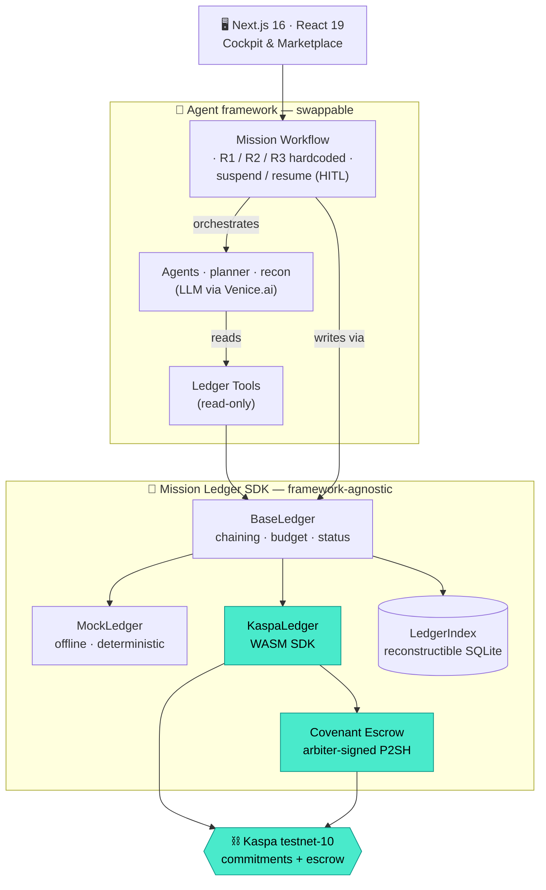
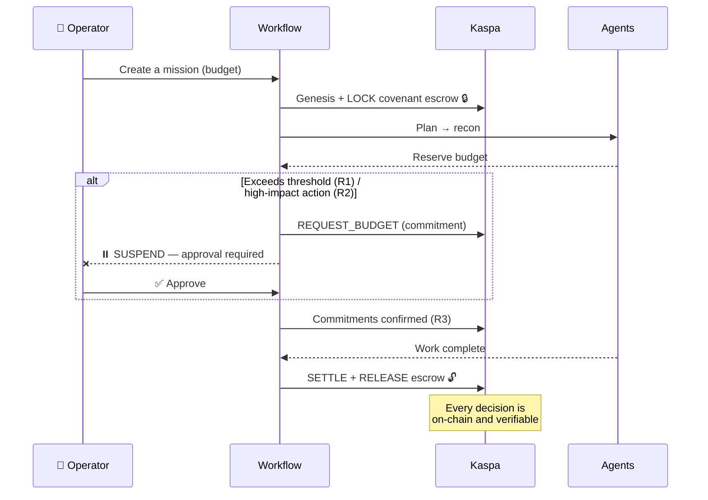

<div align="center">

# ⛓️ Kaspa Mission Control

### The **on-chain governance layer** for autonomous AI agent teams.

*Agents coordinate only through immutable commitments published on Kaspa.*
**If it's not on the ledger, it didn't happen.**

<br/>


</div>

---

## 📑 Table of Contents

- [The pitch](#-the-pitch)
- [Why Kaspa](#-why-kaspa)
- [Quick start](#-quick-start)
- [Going fully on-chain](#-going-fully-on-chain-testnet-10)
- [Architecture](#-architecture)
- [Mission lifecycle](#-mission-lifecycle)
- [Governance rules](#-governance-rules-hardcoded)
- [Scripts](#-scripts)
- [Stack](#-stack)

---

## 🎯 The pitch

A team of autonomous AI agents goes off the rails fast: runaway budgets, high-risk actions
fired without oversight, and no reliable record of "who did what."

**Kaspa Mission Control** adds a **programmable governance layer** on top of the agent
framework. Agents coordinate their actions only by publishing **immutable commitments** to the
Kaspa ledger. Three invariants are **hardcoded** (never in prompts):

- 🔒 **Budget envelope** — no agent ever exceeds its on-chain budget.
- ✋ **Human-in-the-loop** — any budget increase or high-impact action suspends the workflow
  and requires human approval.
- 📜 **On-ledger coordination** — a transition doesn't "count" until its commitment is
  confirmed on Kaspa. **The Mission Ledger IS the audit trail.**

> **Demo:** an offensive-security audit — agents auditing an authorized target, every decision
> anchored on-chain, every unit of budget locked in a **covenant escrow**.

---

## 💎 Why Kaspa

Kaspa isn't just a place to drop hashes — its speed (sub-second blocks) and **covenants** make
it a real-time governance engine:

| Need | What Kaspa delivers |
|---|---|
| Tamper-proof traceability | Commitments confirmed in < 1s, replayable straight from the chain |
| Conditional budget | **Covenant P2SH escrow**: funds only release at settlement |
| Distributed coordination | Canonical on-ledger ordering, single source of truth |

> ✅ **Full covenant flow proven on testnet-10**: budget **locked** in a P2SH escrow, agent
> commitments confirmed, escrow **released** by an arbiter-signed spend — all as real Kaspa
> transactions, with clickable txids.

---

## 🚀 Quick start

By default everything runs **offline** on a simulated, deterministic ledger (`LEDGER=mock`) —
no key, no network connection required.

```bash
# Prerequisites: Node ≥ 22.13, pnpm 11

# 1. Install
pnpm install

# 2. Configure (defaults are fine for mock mode)
cp .env.example .env

# 3. Launch the UI
pnpm dev          # → http://localhost:3000
```

```bash
# See the governance engine in action (full workflow + R1 budget gate)
pnpm run-mission
```

---

## 🔗 Going fully on-chain (testnet-10)

```bash
# 1. Generate a throwaway test key
pnpm keygen

# 2. In .env:
#    LEDGER="kaspa"
#    KASPA_PRIVATE_KEY="…"   (or KASPA_MNEMONIC)

# 3. Fund the printed kaspatest: address via the faucet
#    → https://faucet-tn10.kaspanet.io

# 4. Write a real mission to the chain (lock escrow → commitments → release)
pnpm hello:mission
```

The script prints an explorer link for every transaction: genesis, covenant-escrow lock,
agent commitments, then escrow release at settlement.

> ⚠️ **Testnet only.** The app refuses mainnet by design. Never use a real key.

---

## 🏗️ Architecture

The heart of the project: a clean boundary between the **agent framework (swappable)** and the
**Kaspa governance layer (universal)**. Agents hold *zero* governance logic.



**The principle:** `src/mission-ledger/` knows nothing about Mastra; `src/mastra/tools/` is a
thin adapter exposing the ledger read-only. You can swap Mastra out without touching the
governance layer — *that's the universality argument.*

---

## 🔄 Mission lifecycle



---

## 🛡️ Governance rules (hardcoded)

They live in **code** (`src/mastra/governance.ts`), never in prompts. Whatever the LLM emits,
the workflow enforces them.

| Rule | Invariant | Mechanism |
|---|---|---|
| **R1** | Budget envelope | Reservation > budget / cap / threshold → `REQUEST_BUDGET` + `suspend()` |
| **R2** | High-impact action | Listed action → `ApprovalRequest` + `suspend()` |
| **R3** | On-ledger ordering | `publishAndConfirm` waits for confirmation before proceeding |

---

## 📜 Scripts

| Command | Purpose |
|---|---|
| `pnpm dev` | Dev UI (Next.js + Turbopack) |
| `pnpm run-mission` | End-to-end workflow: happy path **and** the R1 budget gate (suspend → approve → resume) |
| `pnpm hello:mission` | Real on-chain proof: mission + covenant escrow + commitments on testnet-10 |
| `pnpm ledger:demo` | Mission Ledger demo (mock): full chain + simulated escrow + settlement |
| `pnpm keygen` | Generate a throwaway testnet key/address |
| `pnpm test` · `pnpm test:e2e` | Unit tests (Vitest) · e2e (Playwright) |

---

## 🧱 Stack

**Frontend** — Next.js 16 (App Router, Turbopack) · React 19 · Tailwind 4 · Framer Motion · Recharts
**Agents** — Mastra (agents + durable workflows) · Venice.ai (LLM) · Zod 4
**On-chain** — Kaspa testnet-10 via WASM SDK · covenants / P2SH escrow · reconstructible SQLite (libsql) index
**Quality** — TypeScript 5 · Vitest · Playwright · ESLint · Prettier · Pino

---

<div align="center">

*Built for the Kaspa hackathon — "Build Programmable Agent Interactions with Kaspa."*

**⛓️ If it's not on the ledger, it didn't happen.**

</div>
